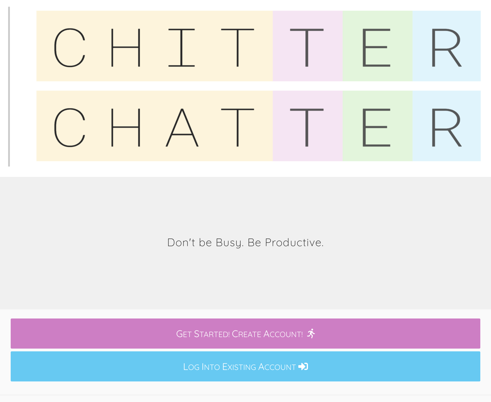
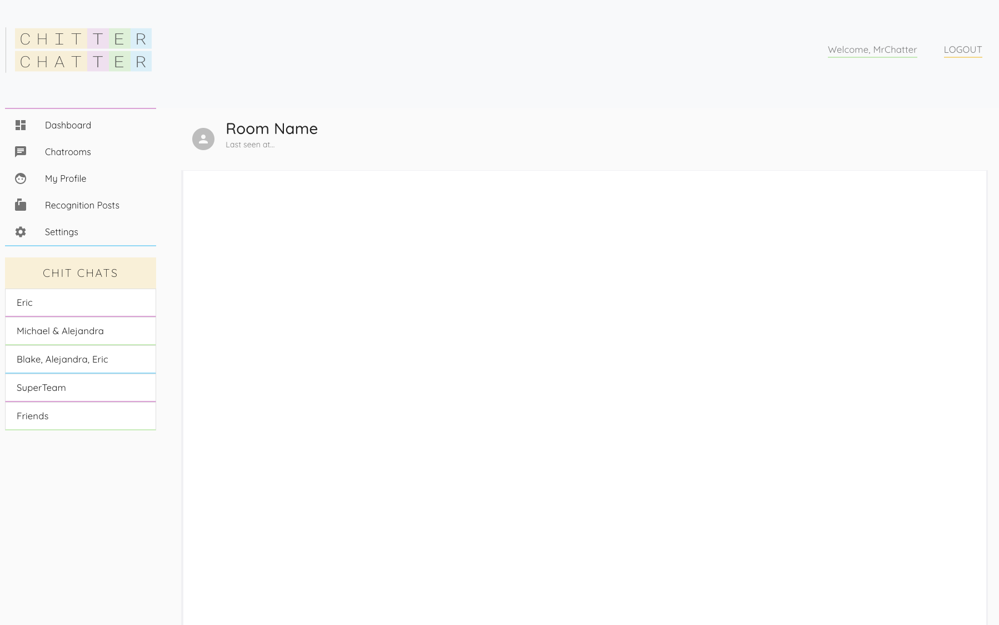

# Chitter Chatter App

## Description

Welcome to Chitter Chatter, a morale booster/community builder app!  We are a small group of web developers looking to create an application for small businesses to help put productivity back in the workplace with our featured chat box and many other features coming soon!

## Table of Contents

* [USER-STORY](#user-story)

* [ACCEPTANCE-CRITERIA](#acceptance-criteria)

* [Technology](#technology)

* [Deployment](#deployment)

* [Screenshots](#screenshots)

* [Future-updates](#future-updates)

* [Author](#author)

* [Acknowledgements](#acknowledgements)

## USER-STORY

    
Click to expand

AS a manager in a company considering a community builder application

I WANT to be able send messages to my employees and co-workers

SO THAT I can let them know I am grateful for their good work

## ACCEPTANCE-CRITERIA

    
Click to expand

GIVEN I am looking to communicate with my co-workers through a company chatroom

WHEN I enter my message in the input field

THEN I am shown that it was sent successfully

## Technology

* ReactJS
* Node and Express Web Server
* MongoDB Atlas
* routes (GET, POST, etc.)
* Heroku deployment
* Passport user authentication
* Pusher

## Deployment

* The URL of the deployed application is [here](#)

* The URL of the GitHub repository is [here](https://github.com/bbrintle/community-chat-app)

## Screenshots
* **Landing Page**

* **Dashboard**

## Feature-updates
### Under construction

* High-five reward/kudos system
* Shoutout boards
* Recognition posts page
* Private message capability
* Message comment capability

## Authors

* Brintle, Blake
* Donohue, Eric
* Hanson, Michael
* Reyes, Alejandra

## Acknowledgements

* Our instructor